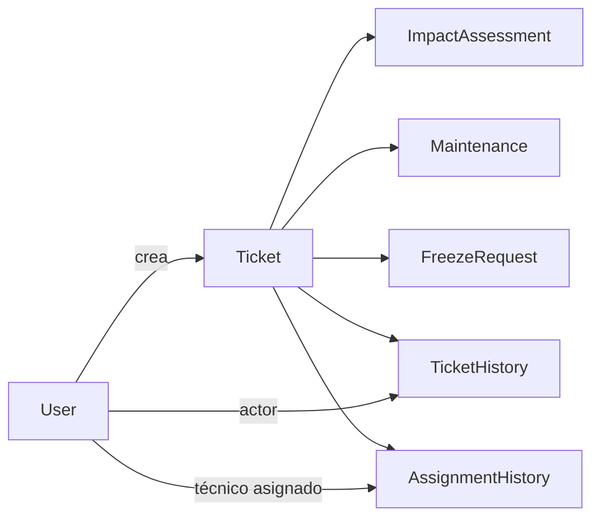

# Modelo funcional del dominio

## Decisión central

**Solicitud, mantención y cierre forman parte del mismo `Ticket` y no son flujos independientes.**

La interfaz puede presentarlos en secciones, pero el ticket conserva el mismo ID durante todo el ciclo. No se debe duplicar información en flujos que luego necesiten fusionarse.

## Conceptos

### `Ticket`

Unidad principal. Representa una sola falla reportada e integra solicitud, gestión, mantención, resolución, cierre e historial. Nace en `NEW` y, si completa el ciclo, termina en `CLOSED`.

### Solicitud

Etapa inicial del ticket. Contiene la descripción de la falla, área cuando corresponda, ubicación, máquina o equipo, solicitante autenticado, fecha/hora y cinco respuestas de impacto. El creador puede editarla solo mientras el ticket está `NEW`.

### Mantención

Trabajo técnico asociado a un ticket asignado. Registra inicio, diagnóstico, trabajo realizado, observaciones y evidencia final si se autoriza. Solo el técnico actualmente asignado puede operar sobre ella.

### Asignación

Vínculo temporal entre un ticket y un técnico disponible. Mantiene quién asignó, cuándo comenzó y cuándo/por qué se liberó. Las asignaciones anteriores no se sobrescriben.

### Prioridad

Clasificación `LOW`, `MEDIUM`, `HIGH` o `CRITICAL`, calculada por backend a partir de la evaluación de impacto. Un `ADMIN` puede corregirla excepcionalmente con motivo y trazabilidad.

### Congelamiento

Pausa autorizada cuando la mantención no puede continuar. La solicitud nace en `IN_PROGRESS`; mientras está pendiente el técnico sigue ocupado. Si se aprueba, el ticket queda `FROZEN` sin técnico activo.

### Resolución

Acción del técnico asignado que declara terminado el trabajo desde `IN_PROGRESS`. Requiere trabajo realizado, registra fecha/hora, libera la asignación y deja el ticket `RESOLVED`.

### Cierre

Validación administrativa final. Solo un `ADMIN` puede pasar un ticket de `RESOLVED` a `CLOSED`. El ticket cerrado es inmutable y no se reabre en el MVP.

### Historial

Registro cronológico de acciones relevantes. Conserva actor, timestamp, acción, estados anterior/nuevo y detalles o motivos cuando correspondan.

## Relaciones conceptuales

El diagrama expresa conceptos recomendados por la especificación, no tablas ni cardinalidades irrevocables.

## Ciclo de vida resumido

`NEW -> ASSIGNED -> IN_PROGRESS -> RESOLVED -> CLOSED`

Con congelamiento:

`IN_PROGRESS -> FREEZE_REQUESTED -> FROZEN -> PENDING_REASSIGNMENT -> ASSIGNED -> IN_PROGRESS`

El rechazo de congelamiento retorna `FREEZE_REQUESTED -> IN_PROGRESS`.

## Invariantes

- Un ticket corresponde a una sola falla y mantiene su identidad (`RN-01`).
- Solo el creador edita su solicitud y únicamente en `NEW` (`RN-02`).
- `currentTechnicianId` es nulo cuando no existe asignación activa; permanece definido en `ASSIGNED`, `IN_PROGRESS` y `FREEZE_REQUESTED`; se limpia al aprobar congelamiento o resolver.
- Un técnico no puede tener más de una mantención en `ASSIGNED`, `IN_PROGRESS` o `FREEZE_REQUESTED` (`RN-06`, `RN-07`).
- Las transiciones y autorizaciones se validan en backend (`RN-18`).
- Las asignaciones y congelamientos anteriores permanecen trazables.
- Los tickets no se eliminan físicamente (`RN-16`).
- `CLOSED` no admite edición, reapertura ni transición (`RN-17`).
- Acciones que cambian ticket, asignación e historial deben ser atómicas cuando corresponda.

