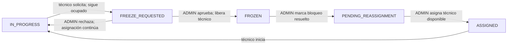

# Flujo de congelamiento

## Solicitud (`RN-10`)

Solo el técnico actualmente asignado puede solicitar congelamiento y únicamente desde `IN_PROGRESS`. Debe indicar un motivo.

Categorías respaldadas por la especificación:

- Falta de repuesto.
- Esperando autorización.
- Falta de personal especializado.
- Equipo o área no disponible.
- Otro; exige detalle obligatorio.

Efectos:

- ticket pasa a `FREEZE_REQUESTED`;
- técnico sigue `BUSY`;
- asignación sigue activa;
- `currentTechnicianId` no cambia;
- solicitud, técnico, motivo y timestamp quedan trazados.

Esto protege `CA-13`: una solicitud pendiente no libera capacidad.

## Rechazo

Solo `ADMIN` decide. Al rechazar:

- `FREEZE_REQUESTED -> IN_PROGRESS`;
- técnico permanece asignado y ocupado;
- asignación activa continúa;
- decisión, administrador, timestamp y detalle/motivo aplicable quedan en historial.

El Word no declara obligatorio un motivo de rechazo; su obligatoriedad queda pendiente de definición contractual.

## Aprobación (`RN-11`, `CA-08`)

Al aprobar:

- `FREEZE_REQUESTED -> FROZEN`;
- se libera/cierra la asignación activa;
- `currentTechnicianId` queda nulo;
- técnico queda inmediatamente `AVAILABLE`;
- la asignación histórica se conserva;
- decisión, administrador y timestamp quedan en historial.

“Eliminar la asignación activa” significa quitar el vínculo actual, no borrar el registro histórico.

## Retomar (`RN-12`, `RN-13`, `RN-21`)

Una mantención `FROZEN` no se reactiva automáticamente.

1. `ADMIN` confirma que la causa del bloqueo fue resuelta.
2. Ticket pasa `FROZEN -> PENDING_REASSIGNMENT` (`CA-14`).
3. `ADMIN` elige un técnico disponible, original u otro (`CA-10`).
4. Ticket pasa `PENDING_REASSIGNMENT -> ASSIGNED`.
5. El técnico asignado inicia explícitamente.
6. Ticket pasa `ASSIGNED -> IN_PROGRESS`.

No se permite `FROZEN -> IN_PROGRESS` ni reinicio sin nueva asignación (`CA-09`).

## Flujo visual

## Trazabilidad mínima

- Solicitud: técnico, motivo/categoría, detalle cuando corresponda, timestamp.
- Decisión: administrador, aprobada/rechazada, timestamp y detalle disponible.
- Liberación: asignación terminada y motivo de liberación.
- Bloqueo resuelto: administrador y timestamp.
- Nueva asignación: técnico, administrador y timestamp.

## Relación normativa

| Referencia | Cobertura |
|---|---|
| `RN-10` | Solicitud solo desde `IN_PROGRESS`. |
| `RN-11` | Aprobación libera técnico y conserva historial. |
| `RN-12` | Congelada requiere reasignación antes de iniciar. |
| `RN-13` | Reasignación al original u otro disponible. |
| `RN-21` | Solo `ADMIN` marca lista para retomar. |
| `CA-08` | Liberación y trazabilidad tras aprobación. |
| `CA-09` | Sin reinicio antes de nueva asignación. |
| `CA-10` | Reasignación a cualquier técnico disponible. |
| `CA-13` | Técnico sigue ocupado mientras está pendiente. |
| `CA-14` | Solo administrador realiza `FROZEN -> PENDING_REASSIGNMENT`. |
