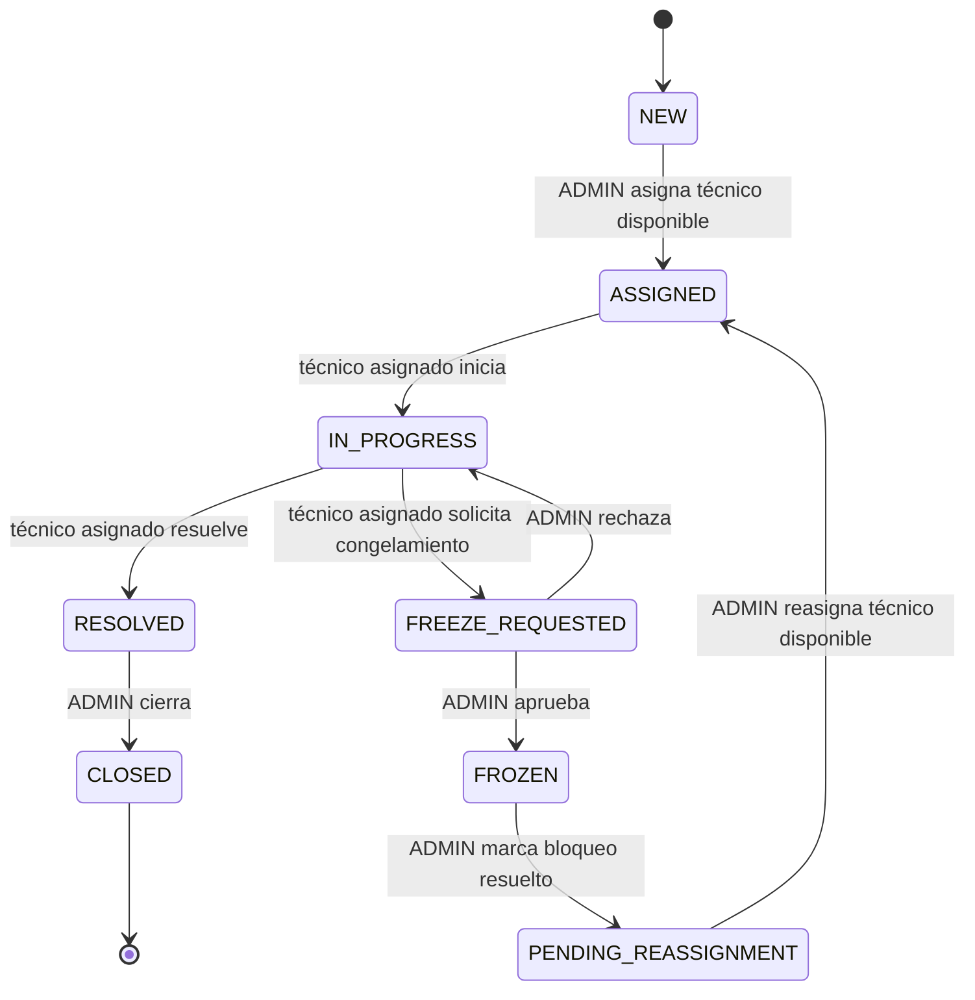

# Ciclo de vida del ticket

## Estados técnicos

| Estado | Significado | Quién puede actuar | Acciones válidas | Efectos relevantes |
|---|---|---|---|---|
| `NEW` — Nueva | Ticket creado, sin asignación y editable por su creador. | Creador; `ADMIN`. | Creador edita. `ADMIN` asigna técnico disponible. | La asignación define `currentTechnicianId`, crea historial y ocupa al técnico. |
| `ASSIGNED` — Asignada | Existe técnico responsable; el trabajo no ha iniciado. | Técnico actual. | Iniciar mantención. | Registra inicio y pasa a `IN_PROGRESS`; técnico continúa ocupado. |
| `IN_PROGRESS` — En proceso | Técnico trabajando activamente. | Técnico actual. | Registrar información; resolver; solicitar congelamiento. | Resolver libera al técnico. Solicitar congelamiento conserva asignación y ocupación. |
| `FREEZE_REQUESTED` — Congelamiento solicitado | Espera decisión administrativa. | `ADMIN`. | Rechazar o aprobar. | Rechazo conserva técnico; aprobación libera asignación y limpia `currentTechnicianId`. |
| `FROZEN` — Congelada | Mantención pausada, sin técnico activo. | `ADMIN`. | Marcar causa de bloqueo resuelta. | Técnico previo permanece solo en historial; pasa a espera de reasignación. |
| `PENDING_REASSIGNMENT` — Pendiente de reasignación | Lista para retomar, aún sin técnico activo. | `ADMIN`. | Asignar cualquier técnico disponible. | Nueva asignación histórica, `currentTechnicianId` definido y técnico ocupado. |
| `RESOLVED` — Resuelta | Trabajo técnico finalizado; falta cierre administrativo. | `ADMIN`. | Cerrar ticket. | La asignación ya está liberada; técnico disponible. |
| `CLOSED` — Cerrada | Ciclo terminado administrativamente. | Nadie. | Ninguna en el MVP. | Ticket inmutable; sin reapertura ni borrado físico. |

## Tabla de transiciones permitidas

| Estado actual | Actor y acción | Condiciones | Estado siguiente |
|---|---|---|---|
| `NEW` | `ADMIN` asigna | Técnico disponible y validado en backend | `ASSIGNED` |
| `ASSIGNED` | Técnico actual inicia | Identidad coincide con `currentTechnicianId` | `IN_PROGRESS` |
| `IN_PROGRESS` | Técnico actual resuelve | Trabajo realizado obligatorio | `RESOLVED` |
| `IN_PROGRESS` | Técnico actual solicita congelamiento | Motivo obligatorio | `FREEZE_REQUESTED` |
| `FREEZE_REQUESTED` | `ADMIN` rechaza | Solicitud pendiente | `IN_PROGRESS` |
| `FREEZE_REQUESTED` | `ADMIN` aprueba | Solicitud pendiente | `FROZEN` |
| `FROZEN` | `ADMIN` marca bloqueo resuelto | Causa confirmada como resuelta | `PENDING_REASSIGNMENT` |
| `PENDING_REASSIGNMENT` | `ADMIN` asigna | Técnico disponible y validado en backend | `ASSIGNED` |
| `RESOLVED` | `ADMIN` cierra | Observación final opcional | `CLOSED` |

## Diagrama

## Transiciones expresamente inexistentes

- No existe `NEW -> IN_PROGRESS`: primero debe asignarse un técnico.
- No existe `IN_PROGRESS -> CLOSED`: primero debe resolver el técnico y luego cerrar el administrador.
- `FROZEN` no vuelve directamente a `IN_PROGRESS`: requiere `PENDING_REASSIGNMENT`, nueva asignación e inicio explícito.
- `CLOSED` no tiene transiciones; es inmutable.
- No existe reapertura en el MVP.

## Validación y trazabilidad

- La política de transición es responsabilidad del backend, preferentemente en lógica de dominio/servicio y no dispersa en controladores.
- El frontend solo presenta acciones válidas para el rol y estado actuales.
- Todo cambio relevante registra actor, timestamp, estado anterior, estado nuevo y detalle/motivo cuando corresponda.
- Asignación, aprobación de congelamiento, resolución, cierre y sus entradas de historial deben ejecutarse atómicamente cuando modifiquen varias piezas de estado.

